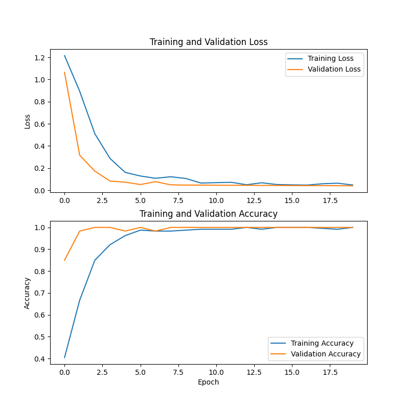
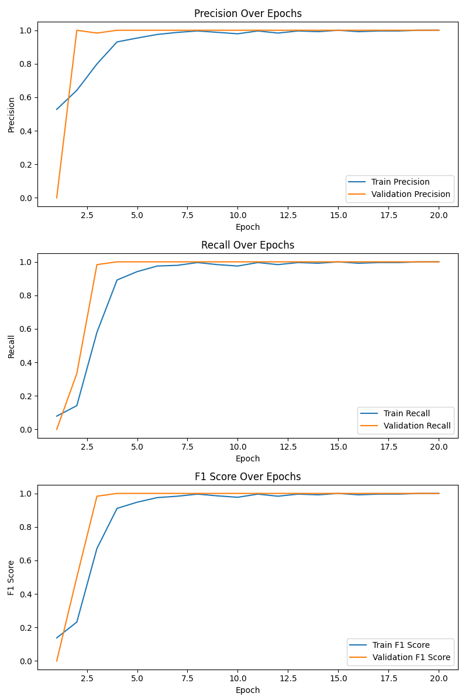

# Lip Reader

 
## Webcam Lip-Reading Prototype
Project Overview: 
This project classifies a small vocabulary from 22-frame webcam clips without audio. I recorded the original data myself, so the results do not establish performance on other speakers.

The demo and graphs below are from 2025. The graphs cover three words and 300 takes. The updated pipeline needs fresh recordings and training; those results do not describe the current code.

### [Historical Training Logs & Notes](./TRAINING_LOGS.md)




## Key Features
- Custom Lip-Reading Model: A 3D CNN for a small set of recorded words.
- Webcam Prediction: Press L to capture a clip and predict a word.
- Data Collection: Saves complete clips from a webcam.
- Shared Preprocessing: Uses the same image processing for training and prediction.
- Training: Uses Adam, sparse cross-entropy and early stopping.

## Source Code Architecture
```
├── collection.py          Captures lip images for a specified word using a webcam.
├── preprocess.py          Processes and normalizes recorded frames for training.
├── train_model.py         Builds and trains a 3D CNN on the preprocessed data.
├── predict.py             Runs a live lip-reading demo using the trained model.
└── evaluate.py            Evaluates a separate set of recorded clips.
```
## Implementation Breakdown
### 1. Data Collection
- Uses Dlib for face and landmark detection to extract the lip region.
- Records 22 frames per word per take, ensuring consistent input dimensions.
- Saves each take in a structured format for easier training.

### 2. Data Preprocessing
Each lip sequence undergoes:

- Grayscale conversion (reduces unnecessary color data).
- Gaussian blurring (removes noise while preserving important features).
- Contrast stretching (enhances lip visibility).
- Bilateral filtering (smooths noise while keeping edges).
- Edge sharpening (enhances clarity of lip movements).
- Normalization (scales pixel values between 0 and 1 for stable training).
- Preprocessed data is stored in .npy format, ensuring efficient model input.

### 3. 3D CNN Architecture
- 3D Convolutional layers to extract spatial and temporal features from the lip movement sequences.
- Max-Pooling layers to reduce feature dimensions.
- Global average pooling and a 64-unit dense layer for classification.
- Softmax activation for multi-class word prediction.
- Input Shape: (22, 80, 112, 1) (22 frames, 80x112 pixel grayscale images, 1 channel).

### 4. Model Training
- Dataset: Custom-recorded words with 80/20 train-validation split.
- Loss Function: Sparse Categorical Cross-Entropy (for multi-class classification).
- Optimizer: Adam (learning rate = 0.0003) for efficient convergence.
- Training Strategy: Batch size = 16, up to 20 epochs with early stopping. The seed, split, history and labels are saved with the model.

### 5. Webcam Prediction
- Uses a webcam feed to detect and track lip movements.
- Captures a 22-frame sequence before making a prediction.
- Matches prediction to the closest trained word.
- Displays the predicted word on screen in real time.

## Usage
Tested with Python 3.12 on macOS. From the repository root:

```sh
python3.12 -m venv .venv
source .venv/bin/activate
python -m pip install -r requirements.txt
python src/collection.py hello
python src/collection.py goodbye
python src/preprocess.py
python src/train_model.py
python src/predict.py
```

Press L to record and Q to quit. Record at least five takes for each of two or more words. Keep one face in view. Use `--camera 1` if needed. More takes are needed for a useful experiment.

New models, labels and run details go in `runs/lip-reader/`. Use `--output` to choose a new preprocessing or training directory. Existing outputs are not overwritten. The old `.h5` file is a different three-word model with no saved word list; it is kept only as a historical artifact.

To evaluate a later recording session, collect each word with `--output data-test`, then run:

```sh
python src/preprocess.py --input data-test --output processed_data-test
python src/evaluate.py --data processed_data-test --output runs/lip-reader/test.json
PYTHONPATH=src python -m unittest discover -s tests -v
```

The test suite uses synthetic clips to check the pipeline, not recognition accuracy. Predictions always choose a trained word, including for unfamiliar words.

## Future Improvements
- Automated triggering of data collection based on lip movement.
- Improved model generalization with a diverse dataset.
- Compare models on separate recording sessions and measure webcam latency.

## Limitations
This is a single-speaker learning project. Recording starts with a key press, so timing matters. The original data is unavailable, and the historical accuracy figures have not been reproduced.
